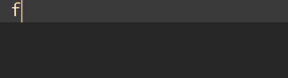

# rSnip

code snippets for noier

提供给noier的代码片段

## 目录

 - [安装](#安装)
 - [语法](#语法)
   - [for 循环](#for-循环)

## 安装

基于:

- vim/neovim
- [vim-plug](https://github.com/junegunn/vim-plug)
  - 其他的vim插件管理插件,例如[Vundle.vim](https://github.com/VundleVim/Vundle.vim)
- [UltiSnips](https://github.com/SirVer/ultisnips)

vim中配置,具体查看[vim-plug](https://github.com/junegunn/vim-plug#example)中的配置方法

```
Plug 'SirVer/ultisnips'
Plug 'Rainboylvx/rSnip'
```

安装
```
:PlugInstall
```

## 语法


### 输入输出

 - printf
 - scanf
 - read
 - out

### 调试

 - DD
 - dd
 - db
 - debug
 - debug_info

### 变量定义

int
i(\d)

常用函数/工具

mem
double_max
inf (1<<30)
st
function F
sct
ct


二进制的输出

### for 循环

for 循环这里最复杂触发，最简单的使用：输入一个`f`(后面可以有无限的空格，下同)，



| 触发            | 结果                        |
|-----------------|-----------------------------|
| [I][r][l]f      | `for([int] i=1; i<=n; ++i)` |
| [I][r][l]f N    | `for([int] i=1; i<=N; ++i)` |
| [I][r][l]f S N  | `for([int] i=S; i<=N; ++i)` |
| [I][r][l]fj s n | `for([int] j=s; i<=N; ++j)` |

例子1： `tody`

## 算法

## 数据结构

| 数据结构   | 触发     |
|------------|----------|
| 链式前向星 | linkList |

